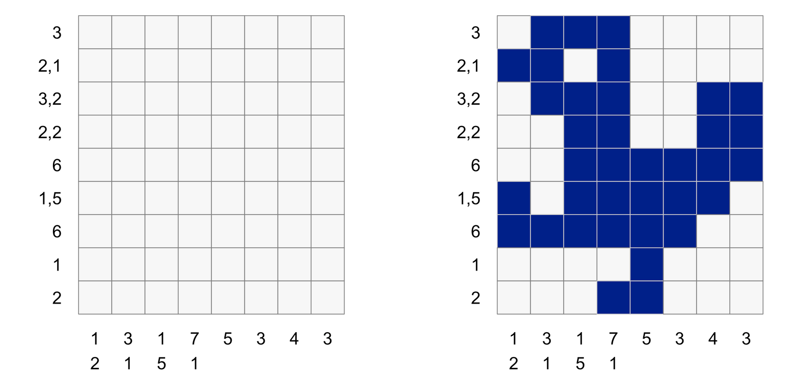

# Le jeu Logimage

Logimage est un jeu de type casse-tête, aussi connu sous de nombreux autres
noms (picross, logigraphe, hanjie, griddler, nonogram...). Il consiste à
reconstituer une image (en une seule couleur dans la version de base du jeu),
en ne connaissant initialement que le nombre et la longueur de chaque groupe de
pixels colorés sur chaque ligne et chaque colonne de l'image.

Voici un exemple de grille et sa solution (source :
[https://coolbutuseless.github.io/](https://coolbutuseless.github.io/)) :

  

Sur cette figure, on voit que la ligne 1 doit contenir un seul groupe de 3
pixels colorés (mais on ne sait pas a priori à quelle position), la seconde
doit contenir un groupe de 2 pixels et un groupe de 1 pixel (séparés par au
moins un pixel blanc), etc. Les indications sur les colonnes sont à comprendre
de la même manière. Par exemple, la quatrième colonne doit contenir un groupe
de 7 pixels colorés et un groupe d'un pixel.

Pour résoudre une grille, on doit à l'aide de déductions logiques colorer
certaines cases les unes après les autres. Quand on a déterminé qu'une case
devait être colorée, cela permet en général de faire de nouvelles déductions,
etc. Un problème bien conçu ne doit avoir qu'une seule solution, si possible
représentant une image amusante ou intéressante.

Pour bien comprendre le principe du jeu et vous familiariser avec sa
présentation et ses règles, vous pouvez jouer quelques parties sur un site de
jeu en ligne, par exemple
[celui-ci](https://fr.goobix.com/jeux-en-ligne/nonograms/).


# Objectif

L'objectif principal de ce projet est de réaliser un programme (graphique)
permettant de jouer à ce jeu. L'utilisateur pourra colorer les cases ou les
effacer par un simple clic gauche sur la case. L'interface doit afficher les
tailles des groupes de pixels colorés sur chaque ligne et sur chaque colonne.
Elle doit également indiquer un message quand une grille est entièrement
résolue.

Outre l'implémentation du jeu lui-même, un deuxième objectif du projet réside
dans la programmation d'un *solveur*, ou générateur automatique de solutions.
Un appui sur une touche du clavier déclenchera le calcul d'une solution du jeu,
et son affichage. 

# Réalisation

Le projet se décompose en quatre tâches principales (toutes obligatoires).

## Tâche 1: Représentation et chargement des grilles

Une grille de logimage peut être représentée par un fichier texte comme suit:

```bash
$ cat logimage-canard.txt
3/2-1/3-2/2-2/6/1-5/6/1/2
1-2/3-1/1-5/7-1/5/3/4/3
```

(La ligne `$ cat logimage-canard.txt` ne fait pas partie du fichier.) 

Ce contenu correspond à la grille utilisée comme exemple plus haut. La première
ligne du fichier contient une description des contraintes pour chaque ligne de
la grille, séparées par des barres obliques ("*slash*"). Pour chaque ligne, les
longueurs des groupes de cases colorées de cette ligne sont indiquées, séparées
par des tirets. Sur la deuxième ligne du fichier figure la description des
longueurs de groupes de pixels colonne par colonne, dans le même format que
précédemment.

Une ligne ou une colonne ne contenant aucun pixel coloré sera simplement
indiquée par une absence de contraintes pour cette ligne ou cette colonne
(visible sous la forme de deux barres obliques consécutives, ou bien une barre
oblique en début ou en fin de ligne).

Le programme réalisé doit être capable de lire des fichiers écrits dans le
format spécifié ci-dessus. Il lui sera ainsi possible de charger les fichiers
proposés sur la page du projet afin de tester le programme.

*Remarque :* une grille n'est pas forcément carrée, elle peut aussi avoir une
forme rectangulaire.


## Tâche 2: Réalisation du moteur de jeu

La deuxième tâche du projet consiste à programmer la logique interne du jeu,
c'est-à-dire la partie qui permet de manipuler la structure de données
représentant l'état de la grille pour simuler l'état de chaque case, ou
déterminer si une grille est résolue.

Il est **très** fortement recommandé de programmer cette partie du projet **indépendamment** des tâches 3 et 4 ci-dessous.

## Tâche 3: Interface graphique

Une interface ergonomique est attendue pour cette étape. Il faudra au minimum
permettre au joueur de charger la grille de son choix parmi un ensemble de
grilles disponibles, afficher les tailles de blocs concernant chaque ligne et
chaque colonne de manière lisible, afficher un message de félicitations en cas
de victoire, et afficher un menu proposant au joueur de quitter, de recommencer
au début ou de charger une autre grille.

L'interface devra également proposer une fonction "Annuler", permettant de
revenir en arrière d'un coup.


## Tâche 4: Recherche de solutions

La quatrième tâche du projet consiste à implémenter un algorithme de recherche
automatique de solution, ou *solveur*, pour le jeu de Logimage. Le rôle du
solveur est de déterminer s'il est possible, à partir de l'état actuel de la
grille, de la compléter afin de satisfaire toutes les contraintes (autrement
dit, d'arriver à une solution), et le cas échéant de fournir une représentation
de la grille résolue.

Le solveur de base ne raisonne pas comme un être humain. Pour une position $(i,
j)$ donnée dans la grille, le solveur cherche à déterminer si cette position
est à l'origine d'un bloc de cases colorées ou non. Il pourra par exemple
raisonner uniquement sur les contraintes de lignes, en vérifiant que les
tentatives explorées respectent aussi les contraintes de colonnes.

Supposons que le prochain bloc à placer sur la ligne $i$ soit de longueur $k$.
Le solveur colore (temporairement, et si c'est possible) le bloc horizontal de
$k$ cases d'origine $(i, j)$. Il cherche ensuite par un appel récursif à partir
de la position $(i, j + k)$ à déterminer si une solution existe dans cette
nouvelle situation. Si oui, la recherche se termine, si non le bloc de $k$
cases est remis dans sa situation précédente et la recherche reprend à la
position $(i, j + 1)$, ou $(i + 1, 0)$ si la case $(i, j + 1)$ n'existe pas. Si
cette nouvelle tentative échoue aussi, c'est qu'il n'existe pas de solution
depuis l'état actuel de la grille.

On résume donc l'algorithme comme suit, en appelant $E$ l'état initial de la
grille, $C$ la liste des contraintes restant à satisfaire et $(i, j)$ la
position où démarre la recherche de solution :

-  Si toutes les contraintes de lignes sont satisfaites, on vérifie si la
   grille est bien gagnante, et on renvoie la solution si c'est le cas (ou un
   échec sinon).

-  Sinon, soit $k$ la première contrainte non encore satisfaite sur la ligne
   $i$ (qui demande l'existence d'un bloc horizontal de $k$ pixels colorés).
   Deux cas sont à traiter :

    1. Bloc de $k$ cases en position $(i, j)$ :

        - on calcule l'état $E'$ de la grille obtenu en plaçant un bloc
          horizontal de $k$ pixels colorés commençant à la position $(i, j)$
          (si c'est impossible, on passe directement au point 2 ci-dessous) ;

        - on vérifie si les contraintes des colonnes $j$ à $j + k$ sont encore
          satisfaisables. Si ce n'est pas le cas, on passe directement au point 2 ;

        - on calcule la liste de listes $C'$ des contraintes de ligne restant à
          satisfaire dans la grille $E'$ (obtenue en retirant la contrainte $k$
          de $C$) ;

        - on fait appel récursivement à l'algorithme de résolution dans $E'$
          avec les contraintes $C'$ à partir de la position $(i, j + k + 1)$
          (ou $(i + 1, 0)$ si l'on a atteint la fin de la ligne $i$) ;

        - si une solution est trouvée à partir de $E'$, c'est aussi une
          solution à partir de $E$ : on la renvoie. Sinon, on passe au point 2.
    
    2. Pas de bloc de $k$ cases en position $(i, j)$ : on fait appel
       récursivement à l'algorithme de résolution dans l'état initial $E$, sur
       la liste de contraintes $C$, à partir de la position $(i, j + 1)$ (ou
       $(i + 1, 0)$ si l'on a atteint la fin de la ligne $i$) et on renvoie le
       résultat trouvé.

Le solveur doit afficher la solution trouvée s'il y en a une, ou revenir à la
situation initiale de la grille s'il échoue. 

Dans un premier temps, *il n'est pas demandé que le
solveur tienne compte des cases déjà colorées par l'utilisateur.*


# Tâches complémentaires


## Amélioration de l'interface graphique

Les joueurs de logimage apprécient de pouvoir indiquer visuellement le fait
qu'une case ne peut pas être colorée, par exemple en la marquant d'une croix ou
d'un point. Il est intéressant d'implémenter cette possibilité dans l'interface
du jeu.

Le programme doit également pouvoir indiquer au joueur si la grille est
entièrement résolue ou s'il reste des problèmes. Une manière de le faire est
d'indiquer visuellement (par exemple en les affichant dans une couleur
différente) les contraintes qui sont satisfaites et celles qui ne le sont pas.


## Solveur graphique

Cette amélioration consiste à réaliser un mode graphique du solveur,
noircissant et rendant à nouveau visibles dans la fenêtre de jeu les cellules
visitées au fur et à mesure de la recherche. Les étapes de recherche peuvent
être animées automatiquement (à une vitesse plus ou moins grande) ou s'afficher
pas à pas par appui sur une touche.

Attention, l'affichage ralentit bien sûr énormément la recherche, c'est
pourquoi le mode graphique est seulement une **option** qu'il doit être facile
de désactiver au besoin.


## Astuces de résolution et amélioration du solveur

Le solveur de base décrit plus haut peut être assez lent. On peut accélérer les
calculs en utilisant un des conseils de résolution décrits sur [cette page
Wikipedia](https://en.wikipedia.org/wiki/Nonogram#Solution_techniques). Le but
de cette amélioration est d'intégrer ces astuces dans le calcul du solveur,
pour pouvoir fixer sans aucun doute le statut (vide ou colorée) d'une
cellule. On peut évidemment ajouter d'autres astuces si l'on en découvre...

Une autre manière d'accélérer le solveur est de choisir un ordre différent dans
lequel travailler sur les lignes (ou les colonnes) du puzzle. Par exemple, il
peut être judicieux de commencer par travailler sur les lignes ou colonnes qui
ont le moins de choix de coloration possibles.


## Autres améliorations suggérées

Voici quelques autres suggestions d'améliorations. Attention, certaines sont
plutôt faciles tandis que d'autres sont assez difficiles.

-   Logimage en couleurs : modifier l'ensemble du programme (y compris le
    solveur) pour permettre de jouer sur des images en couleurs.

-   Éditeur de grilles : proposer une version "création de grilles" permettant
    à un utilisateur de dessiner sa propre image et sauvegardant le résultat
    obtenu sous forme de fichier logimage (voir tâche 1).

-   Implémenter une fonctionnalité "Indice" qui utilise le solveur pour
    indiquer au joueur une cellule à colorer ou à effacer pour arriver à la
    solution.
 
-   Permettre au joueur d'enregistrer une partie en cours ou de charger une
    partie enregistrée. L'enregistrement devra être fait dans un fichier de
    manière à pouvoir être récupéré lors d'une autre session de jeu. Il faut
    pour cela modifier le format de fichier afin de permettre la sauvegarde des
    cellules colorées.

-   Modifier le solveur pour qu'il renvoie la liste de toutes les solutions
    possibles à une grille donnée (en principe une grille bien faite n'a qu'une
    seule solution, mais cela n'est pas garanti a priori).

-   Implémenter un générateur de grilles aléatoires résolubles (c'est-à-dire
    pour lesquels il existe une solution, si possible unique).

-   Permettre de créer de nouveux puzzles logimage en utilisant directement un
    fichier (par exemple au format PPM, voir le problème correspondant). Une version
    avancée de cette amélioration peut également prendre en charge la
    conversion d'une image quelconque, en la recadrant à la bonne taille et
    avec le nombre de couleurs voulu.

Toute autre amélioration est envisageable selon vos idées et envies, à
condition d'en discuter au préalable avec un de vos enseignants.
